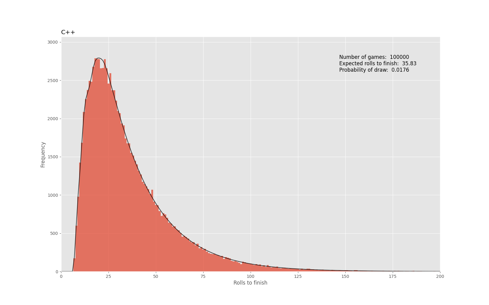

# Snakes & Ladders

[Snakes & Ladders](https://en.wikipedia.org/wiki/Snakes_and_ladders) is a game of pure chance, in which the outcome is entirely determined by the roll of dice.
It can be modelled perfectly as an absorbing Markov chain, in which a player begins at the zeroth position (off the board), and progresses on a journey to the final absorbing square.
The Markovian nature of the game allows it to be modelled stochastically via Monte Carlo, but also deterministiaclly by the Markov matrix representing the system.

Here a Python implementation of the game is made, and the stochastic and deterministic approaches are compared.
The version of the game simulated is such that a player does not need to finish exactly on the final square, but can overshoot to still finish.
Each simulation of the game returns an integer for the number of rolls to reach the finish.
Running multiple games builds up statistics such that a distribution can be seen.
Games can be arbitrarily long due to the existence of cycles, so we should expect to see a large tail to the right, accounting for those unfortunate games requiring many rolls to finish.
We should also expect to see a clear cutoff to the left for the minumum number of rolls required to finish.

The board is defined via a yaml configuration file, which includes the size of the board (ie number of squares), and the positions of all snakes and ladders. 
The particular configuration used here is the classic [Milton Bradley](https://en.wikipedia.org/wiki/Snakes_and_ladders) version from 1943.

In order to speed up each game an equivalent C++ implementation of the multigame simulatiuon was also written, which can be called from Python via Cython.


## Running the simulation (MacOS)

Create and activate a virtual environment:

```bash
python -m venv .venv
source .venv/bin/activate
```
Build the Cython extension:
This generates a compiled extension module (`multigame.cpython-311-darwin.so` on macOS with Python 3.11) that significantly speeds up the game simulation.

```bash
python setup.py build_ext --inplace --verbose
```

Run the simulation:

```bash
uv run python main.py
```

## Results

The simulation is run over 100k games of Snakes & Ladders, using both the full Python implementation and the C++ module.

Histograms are generated to show the distribution of number of rolls to finish, for both implementations.
Both show good agreement with the deterministic solution calculated from the Makov matrix representing the board.

The C++ implementation takes ~0.1s for 100000 games, compared to ~2s for Python (~20x speedup with C++).
The Markov matrix analysis tells us that the expected number of games to finish is ~35.8, and the probability of a draw in a two person game is ~1.76%
The minimum possible number of rolls to finish is 7, and is clear from both the histogram and the Markovian prediction.
One such lucky game is {1, 3, 5, 5, 2, 5, 6}.



